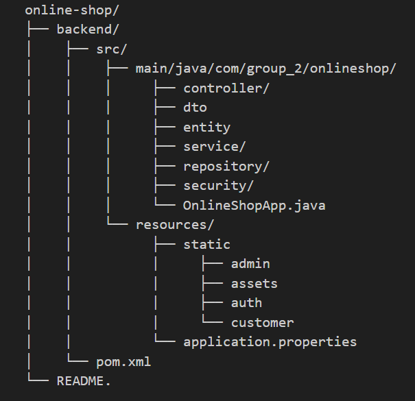

# Online-Shop
* Tổng quan
    - Dự án Online Shop là 1 website thương mại điện tử được xây dựng với back-end Spring Boot, cung cấp các RESTful endpoint để quản lý sản phẩm, người dùng, giỏ hàng và đơn hàng và front-end là Html, Css, JavaScript để gọi đến các Api đã xây dựng.  
    - Mục tiêu chính là xây dựng một nền tảng thương mại điện tử cơ bản, thể hiện khả năng thiết kế backend theo kiến trúc chuẩn và triển khai API bảo mật, dễ mở rộng.

1. Mục tiêu của dự án
    - Xây dựng REST API cho một hệ thống bán hàng trực tuyến.  
    - Cung cấp các chức năng: đăng ký / đăng nhập người dùng, quản lý sản phẩm, giỏ hàng và đơn hàng.  
    - Thực hành kiến trúc Spring Boot + JPA + MySQL với chuẩn RESTful và mô hình 3 tầng.
    - Có Frontend tĩnh bằng HTML + CSS + JavaScript (fetch API từ backend) để kiểm thử các chức năng đã xây dựng.
    - Thể hiện kỹ năng tổ chức dự án theo chuẩn công nghiệp: tách module, RESTful endpoint, và UI tương tác.

2. Hướng dẫn cài đặt (local)
    - Yêu cầu hệ thống:
        + JDK 17
        + Maven 3.8
        + MySQL (sử dụng Xampp)
        + Trình duyệt web (Chrome, Edge, Firefox)
        + Công cụ kiểm thử Postman
    - Clone và cài đặt
        + Tải và cài đặt Intellij IDEA Ultimate (recommend 2024.1.4 version)
        + Mở Git console và gõ các lệnh:
            git clone https://github.com/PhamHoangThai2004/Online-Shop-Back-End
            cd online-shop
        + Cấu hình datatabse: (mở file src/main/resources/application.properties) 
            spring.application.name=OnlineShop
            spring.datasource.url=jdbc:mysql://localhost:3306/online_shop?useSSL=false&serverTimezone=UTC
            spring.datasource.username=root
            spring.datasource.password=("là mật khẩu xampp haowcj mysql)
            spring.jpa.hibernate.ddl-auto=update
            spring.jpa.show-sql=true
            spring.jpa.properties.hibernate.dialect=org.hibernate.dialect.MySQL8Dialect
        + Chạy backend:
            Chạy Intellij hoặc mvn spring-boot:run (nếu dùng maven)
            => Ứng dụng sẽ chạy ở http://localhost:8080 (nếu thành công)
        + Chạy font-end:
            Mở trình duyệt gõ link: http://localhost:8080/index.html
            Có 2 hướng: Chọn Đăng ký hoặc Đăng nhập
            Tài khoản test: TK: phthai - MK: 12345678 (link login: http://localhost:8080/auth/login.html)

3. Cấu trúc thưc mục:

4. Thư viện & phụ thuộc chính
    - Các thư viện và phụ thuộc

    | Tên thư viện và phụ thuộc        | Mô tả chức năng 
    |----------------------------------|--------------------------------------------------------------------------------
    | spring-boot-starter-web          | Cung cấp nền tảng xây dựng ứng dụng web RESTful (Spring MVC, Tomcat embedded). |
    | spring-boot-starter-data-jpa     | Hỗ trợ thao tác cơ sở dữ liệu thông qua JPA/Hibernate. |
    | mysql-connector-j                | Trình điều khiển JDBC kết nối đến cơ sở dữ liệu **MySQL**. |
    | spring-boot-devtools             | Tự động reload khi code thay đổi, giúp tăng tốc phát triển. |
    | spring-boot-starter-security     | Cung cấp bảo mật cho ứng dụng (Spring Security). |
    | jjwt-api, jjwt-impl,             |
    | jjwt-jackson                     | Thư viện **JSON Web Token (JWT)** – dùng để xác thực và phân quyền người dùng. |
    | spring-boot-starter-test         | Cung cấp bộ công cụ kiểm thử (JUnit, Mockito, AssertJ...). |
    | spring-boot-maven-plugin         | Dùng để biên dịch và chạy ứng dụng Spring Boot trực tiếp qua Maven (`mvn spring-boot:run`). |

    - Cấu hình Java:
        **Java version:** `17`  
        **Spring Boot version:** `3.4.5`  
        **Build tool:** `Maven`

5. Ví dụ demo
 

                    

